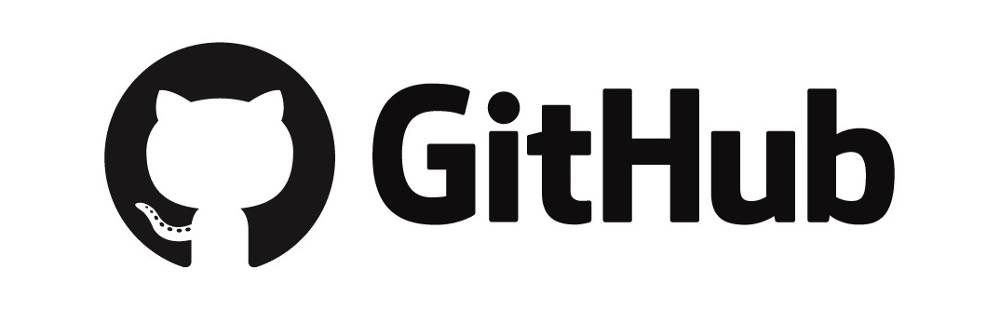
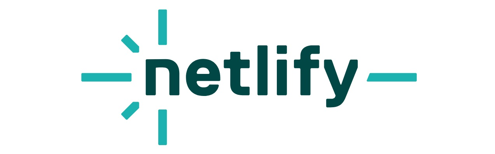

<div style="display: flex; gap:0.25rem; justify-content:center" align="center">
  
<sub>_(Hold **Ctrl** or **Cmd** on Mac and click to open in a new tab)_</sub>

[][Resume]
[][Email]
[][Linkedin]
[][Codewars]
[][Github]
[][WhatsApp]
[][Telegram]
[][X]
[][Slack]


</div>

<h2>⚡ Hi there, I'm <a href="https://github.com/kamallahloh" target="_blank">Kamal Lahloh</a> </h2>

<h3>
A Software Developer at <a href="https://www.linkedin.com/company/general-computers-and-electronics-co/">@GCE</a>, <a href="https://www.meraki-academy.org/">@MERAKI-Academy-Cohort-9</a> graduate, and a Scrum master in the <a href="https://github.com/MetaBookTeam/MERAKI_Academy_Project_5" >@MetaBookTeam</a>.
<br/>
</h3>
<h3>
For more details see my <a href="https://www.dropbox.com/scl/fi/zqcn8s13r63132d7yobgs/Kamal-Lahloh-Resume.pdf?rlkey=jl2lp1m7cb0r4ogbr61s5n34t&st=la818ieh&dl=0">Resume 📄</a>
</h3>


<h3>I'm interested in ↴ </h3> 

[](https://git.io/typing-svg)

<details>
<summary><h2>🎯 Projects</h2></summary>

<div>
  <table>
    <tr>
    <td>METABOOK</td><td>PERN Stack, Social Media platform</td>
      <td><a href = "https://github.com/MetaBookTeam/MetaBook_PERN.stack_Social.Media.Platform">
        
      </a></td>
      <td><a href = "https://c09-metabook.netlify.app">
        
      </a></td>
    </tr>
    <tr>
    <td>K-SHOP</td><td>MERN Stack, E_Commerce website</td>
      <td><a href = "https://github.com/kamallahloh/K-Shop_Full-Stack_E-commerce-website">
        
      </a></td>
      <td><a href = "https://k-shop-mern.netlify.app">
        
      </a></td>
    </tr>
  </table>

  [](https://www.youtube.com/watch?v=j69a7CHLhV0)
  <!--[](https://www.youtube.com/watch?v=j69a7CHLhV0)-->

  [](https://www.youtube.com/watch?v=rt4oTBR1j5Q)
</div>
</details>

<details open >
<summary><h2>⚒️ Skills</h2></summary>

### ♨️🔠 Programming Languages

<div style="display: flex; gap: 0.25rem">


</div>

### 📚🧩 Frameworks & Libraries

<div style="display: flex; gap: 0.25rem">


</div>

### 💻🌐 Frontend Development

<div style="display: flex; gap: 0.25rem">


</div>

### 🖥🔙 Backend Development

<div style="display: flex; gap: 0.25rem">


</div>

<!-- ### Backend as a Service (BaaS) -->

### ☁️🚀 Deployment platforms (cloud infrastructure)

<div style="display: flex; gap: 0.25rem">

<!---->


</div>

<!-- ### 🖇️ Cross Platform

<div style="display: flex; gap: 0.25rem">


</div> -->

### 💾🗄️ Database

<div style="display: flex; gap: 0.25rem">


</div>

### 🔀📝 Version control & Documentation

<div style="display: flex; gap: 0.25rem">

<!--  -->


</div> 

### 🧪🔎 Testing & Validation

<div style="display: flex; gap: 0.25rem">

<!--  -->


</div> 
</details>

<details open >
<summary><h2>🖥️ Workspace Setup & IDEs & Code Editors </h2></summary>

<div style="display: flex; gap: 1rem">


 
 


 


</div>
</details>

<details open >
<summary><h2>📊 Stats & Activities </h2></summary>

<!-- <div align="center">

[](https://github.com/kamallahloh) &nbsp;
[](https://github.com/kamallahloh) &nbsp;
[](https://github.com/sponsors/CyrisXD)

</div> -->

<h3>🔥 Streak Stats</h3>

<div  align="center">

<!-- GitHub Readme Streak Stats - https://github.com/DenverCoder1/github-readme-streak-stats -->

<a href="https://git.io/streak-stats"></a>
</div>

<h3>👤 Profile Stats</h3>
<div  align="center">

<!-- <a href="https://github.com/anuraghazra/github-readme-stats"></a>-->

<a href="https://github.com/kamallahloh/github-readme-stats-fork"></a>
<a href="https://github.com/anuraghazra/github-readme-stats"></a>
<br/>

<!-- <b>Note:</b> Top languages is only a metric of the languages my public code consists of and doesn't reflect experience or skill level. -->

<!-- <a href="https://github.com/ashutosh00710/github-readme-activity-graph"></a> -->


<!--  -->

</div>

<h3>🪄 Activities</h3>

<div>

<!--START_SECTION:waka-->


**🐱 My GitHub Data** 

> 📦 ? Used in GitHub's Storage 
 > 
> 🏆 258 Contributions in the Year 2025
 > 
> 🚫 Not Opted to Hire
 > 
> 📜 18 Public Repositories 
 > 
> 🔑 0 Private Repositories 
 > 
**I'm a Night 🦉** 

```text
🌞 Morning                139 commits         ⣿⣿⣿⣿⣿⣀⣀⣀⣀⣀⣀⣀⣀⣀⣀⣀⣀⣀⣀⣀⣀⣀⣀⣀⣀   20.90 % 
🌆 Daytime                183 commits         ⣿⣿⣿⣿⣿⣿⣿⣀⣀⣀⣀⣀⣀⣀⣀⣀⣀⣀⣀⣀⣀⣀⣀⣀⣀   27.52 % 
🌃 Evening                255 commits         ⣿⣿⣿⣿⣿⣿⣿⣿⣿⣿⣀⣀⣀⣀⣀⣀⣀⣀⣀⣀⣀⣀⣀⣀⣀   38.35 % 
🌙 Night                  88 commits          ⣿⣿⣿⣀⣀⣀⣀⣀⣀⣀⣀⣀⣀⣀⣀⣀⣀⣀⣀⣀⣀⣀⣀⣀⣀   13.23 % 
```
📅 **I'm Most Productive on Wednesday** 

```text
Monday                   120 commits         ⣿⣿⣿⣿⣿⣀⣀⣀⣀⣀⣀⣀⣀⣀⣀⣀⣀⣀⣀⣀⣀⣀⣀⣀⣀   18.05 % 
Tuesday                  62 commits          ⣿⣿⣀⣀⣀⣀⣀⣀⣀⣀⣀⣀⣀⣀⣀⣀⣀⣀⣀⣀⣀⣀⣀⣀⣀   09.32 % 
Wednesday                131 commits         ⣿⣿⣿⣿⣿⣀⣀⣀⣀⣀⣀⣀⣀⣀⣀⣀⣀⣀⣀⣀⣀⣀⣀⣀⣀   19.70 % 
Thursday                 117 commits         ⣿⣿⣿⣿⣀⣀⣀⣀⣀⣀⣀⣀⣀⣀⣀⣀⣀⣀⣀⣀⣀⣀⣀⣀⣀   17.59 % 
Friday                   48 commits          ⣿⣿⣀⣀⣀⣀⣀⣀⣀⣀⣀⣀⣀⣀⣀⣀⣀⣀⣀⣀⣀⣀⣀⣀⣀   07.22 % 
Saturday                 98 commits          ⣿⣿⣿⣿⣀⣀⣀⣀⣀⣀⣀⣀⣀⣀⣀⣀⣀⣀⣀⣀⣀⣀⣀⣀⣀   14.74 % 
Sunday                   89 commits          ⣿⣿⣿⣀⣀⣀⣀⣀⣀⣀⣀⣀⣀⣀⣀⣀⣀⣀⣀⣀⣀⣀⣀⣀⣀   13.38 % 
```


📊 **This Week I Spent My Time On** 

```text
🕑︎ Time Zone: Asia/Amman

💬 Programming Languages: 
Other                    11 hrs 35 mins      ⣿⣿⣿⣿⣿⣿⣿⣿⣿⣀⣀⣀⣀⣀⣀⣀⣀⣀⣀⣀⣀⣀⣀⣀⣀   37.42 % 
TypeScript               7 hrs 6 mins        ⣿⣿⣿⣿⣿⣿⣀⣀⣀⣀⣀⣀⣀⣀⣀⣀⣀⣀⣀⣀⣀⣀⣀⣀⣀   22.95 % 
C#                       3 hrs 20 mins       ⣿⣿⣿⣀⣀⣀⣀⣀⣀⣀⣀⣀⣀⣀⣀⣀⣀⣀⣀⣀⣀⣀⣀⣀⣀   10.80 % 
JavaScript               2 hrs 23 mins       ⣿⣿⣀⣀⣀⣀⣀⣀⣀⣀⣀⣀⣀⣀⣀⣀⣀⣀⣀⣀⣀⣀⣀⣀⣀   07.75 % 
SQL                      2 hrs 13 mins       ⣿⣿⣀⣀⣀⣀⣀⣀⣀⣀⣀⣀⣀⣀⣀⣀⣀⣀⣀⣀⣀⣀⣀⣀⣀   07.17 % 

🔥 Editors: 
Chrome                   13 hrs 45 mins      ⣿⣿⣿⣿⣿⣿⣿⣿⣿⣿⣿⣀⣀⣀⣀⣀⣀⣀⣀⣀⣀⣀⣀⣀⣀   44.44 % 
VS Code                  8 hrs 8 mins        ⣿⣿⣿⣿⣿⣿⣿⣀⣀⣀⣀⣀⣀⣀⣀⣀⣀⣀⣀⣀⣀⣀⣀⣀⣀   26.29 % 
Visual Studio            5 hrs 29 mins       ⣿⣿⣿⣿⣀⣀⣀⣀⣀⣀⣀⣀⣀⣀⣀⣀⣀⣀⣀⣀⣀⣀⣀⣀⣀   17.71 % 
Ssms                     2 hrs 11 mins       ⣿⣿⣀⣀⣀⣀⣀⣀⣀⣀⣀⣀⣀⣀⣀⣀⣀⣀⣀⣀⣀⣀⣀⣀⣀   07.07 % 
Rider                    1 hr 14 mins        ⣿⣀⣀⣀⣀⣀⣀⣀⣀⣀⣀⣀⣀⣀⣀⣀⣀⣀⣀⣀⣀⣀⣀⣀⣀   03.99 % 

🐱‍💻 Projects: 
gce-ifms                 15 hrs 46 mins      ⣿⣿⣿⣿⣿⣿⣿⣿⣿⣿⣿⣿⣿⣀⣀⣀⣀⣀⣀⣀⣀⣀⣀⣀⣀   50.91 % 
gcekroka                 10 hrs 26 mins      ⣿⣿⣿⣿⣿⣿⣿⣿⣀⣀⣀⣀⣀⣀⣀⣀⣀⣀⣀⣀⣀⣀⣀⣀⣀   33.69 % 
GCE.Ekroka               2 hrs 12 mins       ⣿⣿⣀⣀⣀⣀⣀⣀⣀⣀⣀⣀⣀⣀⣀⣀⣀⣀⣀⣀⣀⣀⣀⣀⣀   07.12 % 
Unknown Project          2 hrs 11 mins       ⣿⣿⣀⣀⣀⣀⣀⣀⣀⣀⣀⣀⣀⣀⣀⣀⣀⣀⣀⣀⣀⣀⣀⣀⣀   07.07 % 
GCE.IFMS                 22 mins             ⣀⣀⣀⣀⣀⣀⣀⣀⣀⣀⣀⣀⣀⣀⣀⣀⣀⣀⣀⣀⣀⣀⣀⣀⣀   01.21 % 

💻 Operating System: 
Windows                  30 hrs 58 mins      ⣿⣿⣿⣿⣿⣿⣿⣿⣿⣿⣿⣿⣿⣿⣿⣿⣿⣿⣿⣿⣿⣿⣿⣿⣿   100.00 % 
```

**I Mostly Code in JavaScript** 

```text
JavaScript               8 repos             ⣿⣿⣿⣿⣿⣿⣿⣿⣿⣿⣿⣿⣀⣀⣀⣀⣀⣀⣀⣀⣀⣀⣀⣀⣀   47.06 % 
C#                       5 repos             ⣿⣿⣿⣿⣿⣿⣿⣀⣀⣀⣀⣀⣀⣀⣀⣀⣀⣀⣀⣀⣀⣀⣀⣀⣀   29.41 % 
TypeScript               2 repos             ⣿⣿⣿⣀⣀⣀⣀⣀⣀⣀⣀⣀⣀⣀⣀⣀⣀⣀⣀⣀⣀⣀⣀⣀⣀   11.76 % 
Dockerfile               1 repo              ⣿⣀⣀⣀⣀⣀⣀⣀⣀⣀⣀⣀⣀⣀⣀⣀⣀⣀⣀⣀⣀⣀⣀⣀⣀   05.88 % 
Python                   1 repo              ⣿⣀⣀⣀⣀⣀⣀⣀⣀⣀⣀⣀⣀⣀⣀⣀⣀⣀⣀⣀⣀⣀⣀⣀⣀   05.88 % 
```


**Timeline**


 Last Updated on 23/04/2025 01:06:06 UTC
<!--END_SECTION:waka-->

**These Readme stats are generated using github action [awesome-readme-stats](https://github.com/anmol098/waka-readme-stats)**

NOTE: Top languages does not indicate my skill level or anything like that. It is just a metric of which languages have been hosted by me on GitHub based on the usage across repositories. There are others which I haven't put up on GitHub.

</div>

</details>

<details open >
<summary><h2>🤙 Connect with me</h2></summary>

<div style="display: flex; gap:0.25rem">

<!-- [][portfolio]
[][resume] -->
<!-- [][dev.to] -->

[][Resume]
[][Email]
[][Linkedin]
[][Github]
[][Codewars]
[][WhatsApp]
[][Telegram]
[][X]
[][Slack]

</div>

<div align="center">

[](https://github.com/piyushsuthar/github-readme-quotes)

### never hesitate to call me on 
### 📞 +962 777 3 111 50 📞

</div>

</details>

<!--[portfolio]:-->

[Resume]: https://www.dropbox.com/scl/fi/zqcn8s13r63132d7yobgs/Kamal-Lahloh-Resume.pdf?rlkey=jl2lp1m7cb0r4ogbr61s5n34t&st=la818ieh&dl=0
[LinkedIn]: https://www.linkedin.com/in/kamal-lahloh/
[Dev.to]: https://dev.to/kamallahloh
[Codewars]: https://www.codewars.com/users/kamallahloh

<!-- [twitter]: https://twitter.com/Kamal_Lahloh -->
<!-- [][twitter] -->

[X]: https://x.com/Kamal_Lahloh
[Github]: https://github.com/kamallahloh?tab=follow
[WhatsApp]: https://wa.me/962777311150
[Telegram]: https://t.me/kamallahloh
[Email]: mailto:kamal.lahloh@gmail.com
[Slack]: https://join.slack.com/t/kamal-lahloh/shared_invite/zt-2u7we4z9f-8pi3jPdF0xnfIroM69QonQ
